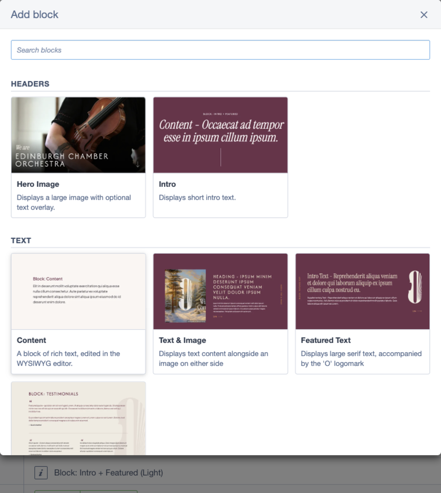

# Silverstripe Visual Block Picker

Replaces Elemental's "Add block" popover with a modal that shows each block as a screenshot
card with its name and description, organised into groups. The search box still works, and
now matches descriptions and group names too.



Screenshots are matched by filename, so adding one is drag-and-drop — no code, no config.
Blocks without a screenshot fall back to an icon tile, so the picker is useful straight away.

## Requirements

- Silverstripe CMS 6
- `dnadesign/silverstripe-elemental` 6
- PHP 8.3+

## Versions

| Module | Silverstripe CMS | Elemental | Branch |
| --- | --- | --- | --- |
| 2.x | 6 | 6 | `main` |
| 1.x | 5 | 5 | `1` |

This is the 2.x branch, for CMS 6. Composer picks the right major for your project
automatically.

## Installation

```bash
composer require purplespider/silverstripe-visual-block-picker
```

Then flush: visit any page with `?flush=1`, or run `sake db:build --flush`.

That's it — there's no build step and nothing to configure to get started.

## Adding screenshots

Create `public/images/blocks/` and drop in an image named after each block class:

```
public/images/blocks/HeroBlock.png
public/images/blocks/TextImageBlock.webp
```

Flush, and the cards appear. Recognised extensions in order of preference: `webp`, `png`,
`jpg`, `jpeg`, `svg`. Cards use a 16:9 area with `object-fit: cover`, so landscape images
around 640×360 work well.

If two block classes in different namespaces share a short name, use the fully qualified
name with hyphens instead of backslashes. This form is checked **first**, so it wins:

```
public/images/blocks/App-Blocks-HeroBlock.png
```

The module also looks in `themes/<theme>/dist/images/blocks/`. If you use that location, add
it to your theme's `extra.expose` in `composer.json` and run `composer vendor-expose`, or the
images won't be reachable. `public/images/blocks/` needs no exposing, which is why it's the
default.

## Grouping blocks

Groups render in the order configured, and **cards render in the order you list them**, so
each group can lead with the block people reach for most.

```yaml
PurpleSpider\VisualBlockPicker\Services\BlockPickerConfigProvider:
  groups:
    - title: 'Headers'
      blocks:
        - 'App\Blocks\HeroBlock'
        - 'App\Blocks\IntroBlock'
    - title: 'Media'
      blocks:
        - 'App\Blocks\GalleryBlock'
        - 'App\Blocks\VideoBlock'
```

Anything you don't list falls into a trailing group named by `ungrouped_title`, sorted
alphabetically. Configure no groups at all and the picker renders one flat grid with no
headings.

Per-page restrictions (`allowed_elements` and friends) keep working untouched — the picker
joins its config onto the list Elemental has already filtered for the page being edited.

## Configuration reference

All options sit on `PurpleSpider\VisualBlockPicker\Services\BlockPickerConfigProvider`
unless noted.

| Option | Default | Purpose |
| --- | --- | --- |
| `groups` | `[]` | Ordered list of `{title, blocks}` |
| `ungrouped_title` | `'Other'` | Heading for unlisted blocks. Empty string to drop it |
| `exclude_classes` | `[]` | Block classes to hide from the picker entirely |
| `show_title_icons` | `false` | Show each block's Elemental icon beside its name |
| `screenshot_dirs` <sup>†</sup> | `['public/images/blocks']` | Where to look, first match wins |
| `screenshot_extensions` <sup>†</sup> | `webp, png, jpg, jpeg, svg` | Extensions to probe, in order |

<sup>†</sup> on `PurpleSpider\VisualBlockPicker\Services\ScreenshotResolver`

`show_title_icons` only controls the small icon next to the name. The icon tile shown for
blocks with no screenshot always renders.

## Descriptions

Descriptions come from each block's `class_description`:

```php
private static $class_description = 'Displays text alongside an image.';
```

Elemental's older `$description` static is deprecated and is not read.

For blocks you don't own, you can set `class_description` from YAML — but note a
**translation always wins over it**, and some modules ship one (elemental does for
`ElementContent`). If YAML seems to have no effect, override the translation instead in
`app/lang/en.yml`:

```yaml
en:
  DNADesign\Elemental\Models\ElementContent:
    CLASS_DESCRIPTION: 'A block of rich text.'
```

Check which you're getting with `singleton($class)->i18n_classDescription()`.

## Caching

The payload is cached and rebuilt on `?flush`. If you add a screenshot or change a group and
see no difference, flush. Caching isn't optional here: Silverstripe builds this config on
every CMS page load.

Note that flushing from the CLI won't always clear it for the browser — PHP-FPM and CLI have
separate opcaches. Use `?flush=1` in the browser if a change doesn't show.

## Development

```bash
composer install
vendor/bin/phpunit
vendor/bin/phpcs
```

The client assets in `client/dist` are hand-written and committed deliberately — there is no
webpack step. They use the globals Silverstripe's admin bundle already exposes (React,
Reactstrap, Injector), so the module participates in the CMS's React tree without a build.

## Licence

BSD-3-Clause
